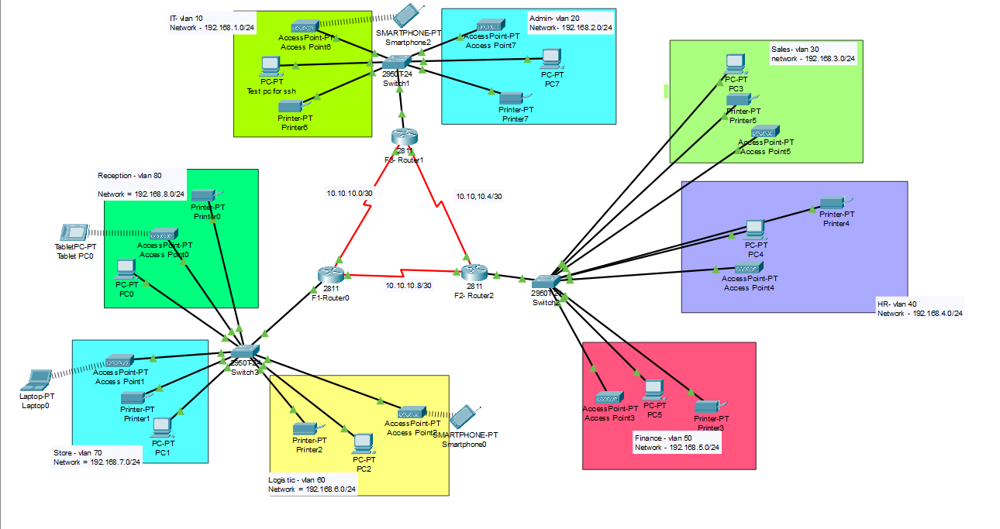
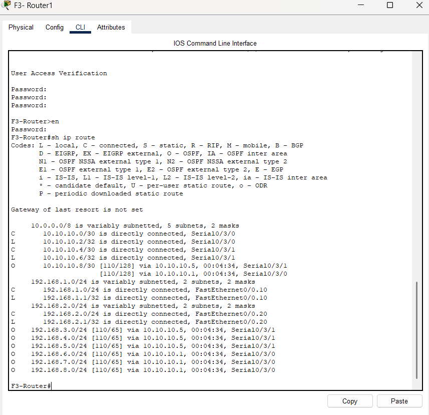
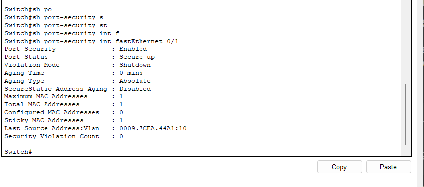
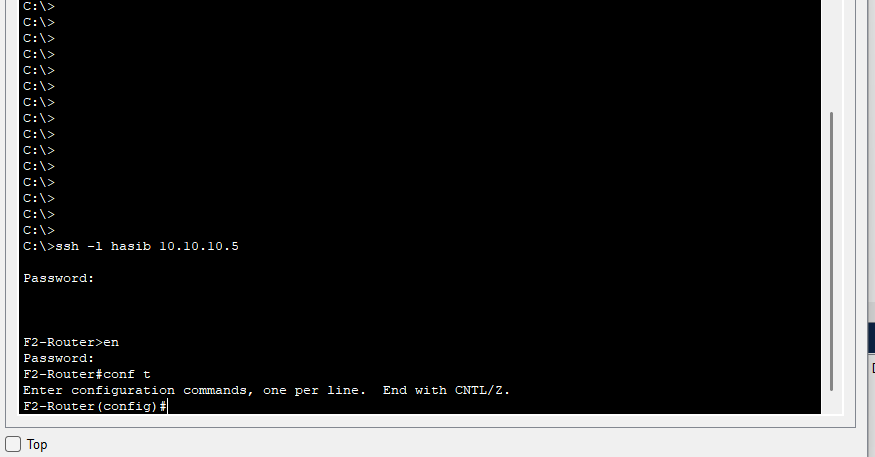

# Vic Modern Hotel Network Design 🏨

### Project Overview
Designed and implemented a scalable, redundant network infrastructure for a three-story hotel building. The project required integrating **OSPF dynamic routing** for high availability between floors and implementing strict **Layer 2 Security** measures.

### 🛠️ Key Technologies & Skills
* 🔄 **OSPF (Open Shortest Path First):** Configured single-area OSPF (Area 0) across three routers to ensure dynamic route updates and redundancy.
* 🛡️ **Port Security:** Implemented "Sticky MAC" address learning on the IT Department switch to prevent unauthorized device access (`violation-mode shutdown`).
* 🔐 **Device Hardening:** Configured SSH (RSA 1024-bit) for secure, encrypted remote management of all routers.
* 📶 **VLAN Segmentation:** Isolated traffic across 8 distinct departments (Finance, HR, Logistics, etc.) to improve performance and security.
* 🔌 **Redundant WAN:** Designed a triangular mesh topology connecting floor routers via Serial DCE links to prevent single points of failure.

---

### 🗺️ Network Topology
The design connects three floors via a mesh WAN, with specific VLANs assigned to each department.

### 📝 VLAN & Addressing Scheme
| Floor | Department | VLAN ID | Subnet |
| :--- | :--- | :--- | :--- |
| **3rd Floor** | IT Dept | 10 | `192.168.1.0/24` |
| | Admin | 20 | `192.168.2.0/24` |
| **2nd Floor** | Sales | 30 | `192.168.3.0/24` |
| | HR | 40 | `192.168.4.0/24` |
| | Finance | 50 | `192.168.5.0/24` |
| **1st Floor** | Logistics | 60 | `192.168.6.0/24` |
| | Store | 70 | `192.168.7.0/24` |
| | Reception | 80 | `192.168.8.0/24` |

---

### 🔐 Security & Access
To verify the security configurations in the lab:

| Feature | Configuration Detail |
| :--- | :--- |
| **SSH Credentials** | Username: `hasib` | Password: `hasib` |
| **Device Passwords** | Console, Enable & VTY Password: `cisco` |
| **Port Security** | IT Switch Port `Fa0/1` allows only the "Test-PC" MAC address. |

---

### ✅ Verification Results

**1. OSPF Neighbor Adjacency**
Verified that all three routers successfully formed full neighbor relationships, exchanging routes dynamically.

**2. Port Security (Sticky MAC)**
The switch interface allows only the authorized Test-PC MAC address. Connecting a rogue device triggers an interface shutdown.

**3. Secure Remote Management (SSH)**
Successful encrypted login to the Gateway Router using the admin account (`hasib`).

---

### 📂 Project Files

* **[Download Packet Tracer File (.pkt)](./Vic_Hotel_Design.pkt)**

